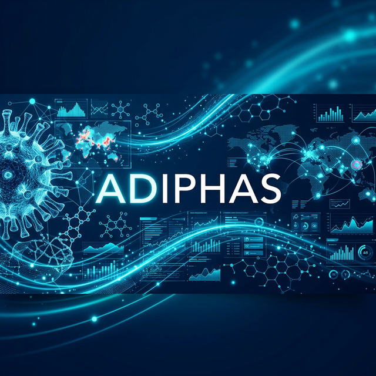
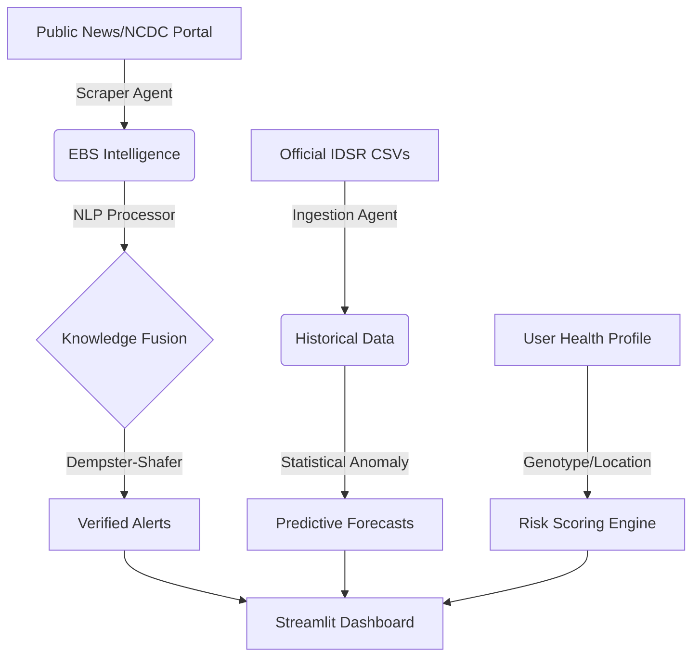

<div align="center">
  
  
  # ADIPHAS
  ### Autonomous Disease Intelligence & Personal Health Advisory System
  
  [](https://www.python.org/)
  [](https://fastapi.tiangolo.com/)
  [](https://streamlit.io/)
  [](LICENSE.txt)
</div>

---

## 🚀 Overview

ADIPHAS is a state-of-the-art **Hybrid Intelligence System** designed for autonomous epidemiological surveillance and personalized health risk mitigation. By bridging the gap between formal health reports (IDSR) and informal news signals (EBS), ADIPHAS provides a robust, research-grade early warning shield for urban health governance in Nigeria.

The system leverages **Dempster-Shafer Theory of Evidence** to combine conflicting signals from independent sources, ensuring highly reliable outbreak detection even in noisy environments.

---

## ✨ Key Features

- **📡 Autonomous Scout (EBS)**: Real-time news scraping and NLP entity extraction using `spaCy` and `Gemini 1.5 Flash`.
- **🧠 Knowledge Fusion**: Mathematical reconciliation of multi-source signals using the **Dempster-Shafer Framework**.
- **📊 IDSR Analytics**: Deep statistical analysis of historical NCDC data with anomaly flagging and predictive forecasting.
- **🛡️ Advisory Chat**: A RAG-powered clinical assistant for both citizens and health experts.
- **📍 Personalized Risk Scoring**: Genotype-aware health scoring integrated with local environmental alerts.

---

## 🏗 System Architecture



---

## 🛠 Installation & Setup

### 🐳 Docker Deployment (Recommended)
Host the entire stack (FastAPI, Streamlit, PostgreSQL) with a single command:
```bash
docker-compose up --build -d
```

### 🐍 Manual setup
1. **Clone & Install**:
   ```bash
   git clone https://github.com/your-repo/ADIPHAS.git
   cd ADIPHAS
   pip install -r requirements.txt
   ```
2. **Environment Configuration**:
   Create a `.env` file from the template and add your `GEMINI_API_KEY`.
3. **Run Services**:
   - Backend: `uvicorn backend.main:app --reload`
   - UI: `streamlit run ui/app.py`

---

## 🔬 Project Defense & Live Simulation

ADIPHAS includes dedicated simulation scripts to demonstrate live outbreak detection:

1. **Lassa Fever (Ikeja)**:
   ```bash
   python tmp/simulate_lassa_full.py
   ```
2. **Cholera (Surulere)**:
   ```bash
   python tmp/simulate_cholera_full.py
   ```
*Observe the 'Red Anomaly Banners' in the IDSR Analytics module and 'Confirmed Intelligence' in the Expert Panel.*

---

## 📜 Documentation

- 📓 **[Methodology](./METHODOLOGY.md)**: Mathematical proof of the Dempster-Shafer Fusion Logic.
- 🚀 **[Deployment Guide](./DEPLOYMENT_GUIDE.md)**: Comprehensive guide for cloud & local hosting.
- 🧪 **[Testing Guide](./TESTING_GUIDE.md)**: Audit trail and validation procedures.

---

<div align="center">
  Developed for Public Health Intelligence & Urban Governance.
</div>
