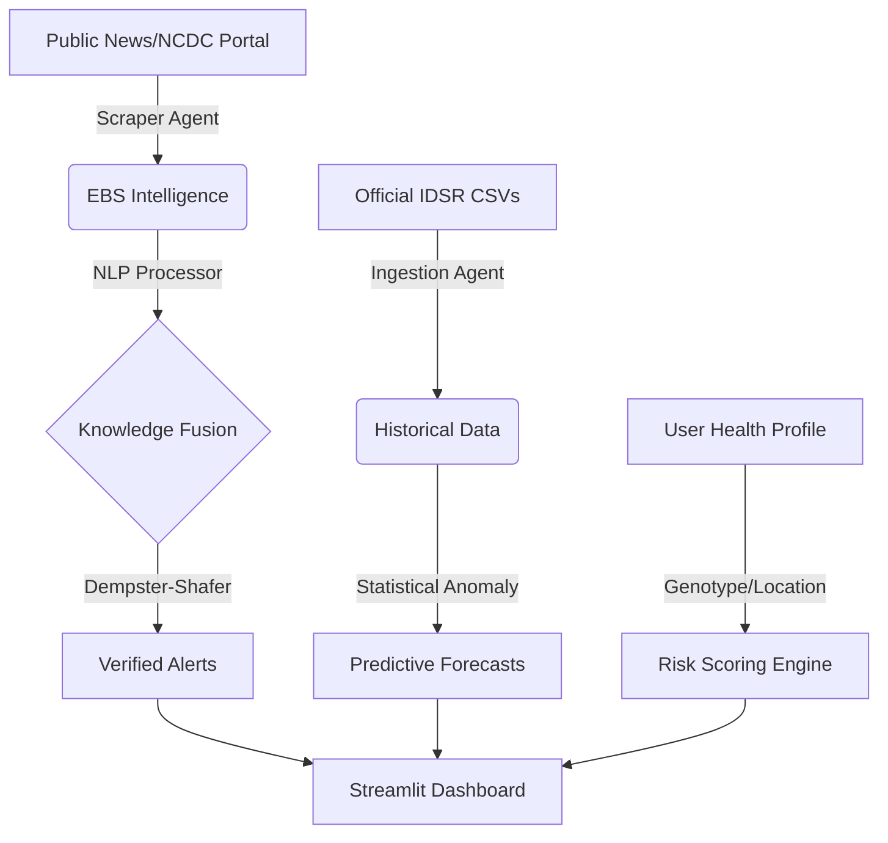

<div align="center">
  
  
  # ADIPHAS
  ### Autonomous Disease Intelligence & Personal Health Advisory System
  
  [](https://www.python.org/)
  [](https://fastapi.tiangolo.com/)
  [](https://streamlit.io/)
  [](LICENSE.txt)
</div>

---

## 🚀 Overview

ADIPHAS is a state-of-the-art **Hybrid Intelligence System** designed for autonomous epidemiological surveillance and personalized health risk mitigation. By bridging the gap between formal health reports (IDSR) and informal news signals (EBS), ADIPHAS provides a robust, research-grade early warning shield for urban health governance in Nigeria.

The system leverages **Dempster-Shafer Theory of Evidence** to combine conflicting signals from independent sources, ensuring highly reliable outbreak detection even in noisy environments.

---

## ✨ Key Features

- **📡 Autonomous Scout (EBS)**: Real-time news scraping and NLP entity extraction using `spaCy` and **Gemini 2.5 Flash**.
- **🧠 Knowledge Fusion**: Mathematical reconciliation of multi-source signals using the **Dempster-Shafer Framework**.
- **🌐 Real-Time Intelligence**: Live global health event tracking powered by the **Tavily Search API**.
- **📊 IDSR Analytics**: Deep statistical analysis of historical **Verified NCDC Data** with anomaly flagging and predictive forecasting.
- **🛡️ Advisory Chat**: A High-Dimensional Hybrid RAG-powered clinical assistant for citizens and health experts.
- **📍 Personalized Risk Scoring**: Genotype-aware health scoring integrated with local environmental alerts.

---

## 🏗 System Architecture


```mermaid
graph TD
    A[Public News/NCDC Portal] -->|Scraper Agent| B(EBS Intelligence)
    B -->|NLP Processor| C{Knowledge Fusion}
    D[Official IDSR CSVs] -->|Ingestion Agent| E(Historical Data)
    C -->|Dempster-Shafer| F[Verified Alerts]
    E -->|Statistical Anomaly| G[Predictive Forecasts]
    F --> H[Streamlit Dashboard]
    G --> H
    I[User Health Profile] -->|Genotype/Location| J[Risk Scoring Engine]
    J --> H
```

---

## 🛠 Installation & Setup

### 🐳 Docker Deployment (Recommended)
Host the entire stack (FastAPI, Streamlit, PostgreSQL) with a single command:
```bash
docker-compose up --build -d
```

### 🚀 Quick Start
The easiest way to run the entire hybrid system (Backend, Frontend, and Autonomous Agents) locally:

1. **Clone & Configure**:
   ```bash
   git clone https://github.com/your-repo/ADIPHAS.git
   cd ADIPHAS
   ```
2. **Environment Variables**:
   Create a `.env` file in the root directory:
   ```env
   GEMINI_API_KEY=your_gemini_key
   TAVILY_API_KEY=your_tavily_key
   ```
3. **Seed Real Epidemic Data**:
   Ensure the Predictive Agent operates on verified, real-world data (Cholera/Lassa):
   ```python
   python seed_real_data.py
   ```
4. **Boot the Analytics Engine**:
   Instantly deploy the FastAPI backend, Streamlit UI, and Background Schedulers. This script automatically handles cold-start delays and port conflicts:
   
   **For Windows (PowerShell):**
   ```powershell
   .\start_adiphas.ps1
   ```
   
   **For Linux / macOS:**
   ```bash
   chmod +x start_adiphas.sh
   ./start_adiphas.sh
   ```

---

## 🔬 Project Defense & Live Simulation

ADIPHAS includes dedicated scripts to demonstrate its capabilities during live defenses:

1. **Verify Real Epidemiological Seed Data**:
   - Access the *Predictive Modeling* tab in the UI to view real 2024/2025 NCDC trajectories for Cholera and Lassa Fever.
2. **Observe Autonomous Cycles**:
   - Watch the terminal running `start_adiphas.ps1` to see the Orchestrator, Scraper, and NLP processor actively categorizing new intelligence globally every 15 minutes.
3. **Test the LLM Fallback Engine**:
   - ADIPHAS features a proprietary robust fallback mechanism (`model_config.py`). If the primary Gemini model is rate-limited, it automatically swerves down the chain to fallback models to keep the system alive without crashing.

---

## ⚠️ Important Considerations for Production

- **Database Concurrency**: ADIPHAS currently uses SQLite by default for easy setup. However, under high concurrency (many simultaneous UI users + background intelligence agents running), SQLite may encounter `database is locked` errors. For production deployments, it is **highly recommended** to migrate the database `DATABASE_URL` in the `.env` file to PostgreSQL.

---

## 📜 Documentation

- 📓 **[Methodology](./METHODOLOGY.md)**: Mathematical proof of the Dempster-Shafer Fusion Logic.
- 🚀 **[Deployment Guide](./DEPLOYMENT_GUIDE.md)**: Comprehensive guide for cloud & local hosting.
- 🧪 **[Testing Guide](./TESTING_GUIDE.md)**: Audit trail and validation procedures.

---

<div align="center">
  Developed for Public Health Intelligence & Urban Governance.
</div>
